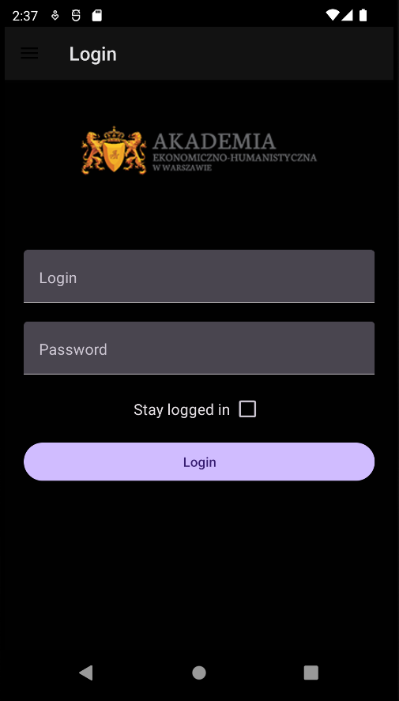
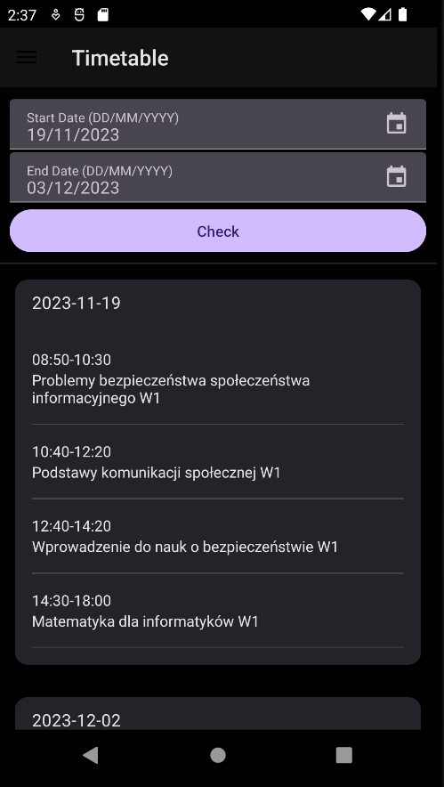

# AEH Vizja App

This mobile application is designed for students at the University of Economics and Human Sciences (AEH) to effortlessly access their class timetables without the need to log in every time. AEH Vizja aims to provide a user-friendly interface for students to stay organized and keep track of their schedules.

## Features

- **Timetable Display:** Easily view your class schedule at a glance.
- **Persistent Login:** No need to log in every time you open the app, thanks to React Native Keychain.
- **User-Friendly Interface:** Intuitive design for seamless navigation.

## Screenshots





## Tech Stack

- **React Native:** The app is developed using React Native, allowing for cross-platform compatibility.
- **React Native Paper:** UI components from the Material Design guidelines for a polished look.
- **React Navigation:** Navigation within the app is handled with React Navigation for a smooth user experience.

## Tested Platforms

The AEH Vizja App has been tested on Android devices. While it's currently optimized for Android, future updates may include compatibility with iOS.

## Notes

- This is the developer's first React Native app, showcasing a learning journey into mobile app development.
- The persistent login feature is implemented using React Native Keychain, ensuring secure and convenient access for users.

## Getting Started

### Prerequisites

- Ensure you have [Node.js](https://nodejs.org/) installed.
- Install [Expo CLI](https://docs.expo.dev/get-started/installation/) globally.

### Installation

1. Clone the repository:
```bash
git clone https://github.com/shiro47/AEH_Vizja-App.git
```
2. Navigate to the project directory:
```bash
cd AEH_Vizja-App
```
3. Install dependencies:
```bash
npm install
```
4. Start the Expo development server:
```bash
npm install
```
This will open the Expo DevTools in your default web browser.

5. Use the Expo Go app on your Android device to scan the QR code from the Expo DevTools to run the app.

## Troubleshooting

If you can't get this to work, see the [Troubleshooting](https://reactnative.dev/docs/troubleshooting) page.

## Learn More

To learn more about React Native, take a look at the following resources:

- [React Native Website](https://reactnative.dev) - learn more about React Native.
- [Getting Started](https://reactnative.dev/docs/environment-setup) - an **overview** of React Native and how setup your environment.
- [Learn the Basics](https://reactnative.dev/docs/getting-started) - a **guided tour** of the React Native **basics**.
- [Blog](https://reactnative.dev/blog) - read the latest official React Native **Blog** posts.
- [`@facebook/react-native`](https://github.com/facebook/react-native) - the Open Source; GitHub **repository** for React Native.

## Contact
For any inquiries, please contact przemek.fied3@proton.me.